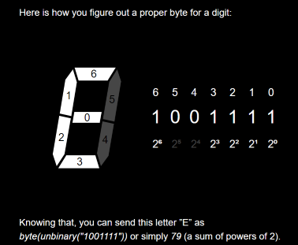

# KataSevenSegments
## Objectif
Simuler un afficheur sept segments (cf https://ksawerykomputery.com/tools/flipdigits-player)

## Spécifications
le système prend en entrée un flux d'octet, chaque octet représentant un des blocs d'affichage.
Par exemple, un "E" correspond à 1001111 en binaire, soit 79 :

.

Les éléments sont ensuite affichés d'abord de haut en bas, puis de gauche à droite.

.

(Ici ce ne sont que des chiffres qui sont affichés, mais cela peut être n'importe quoi)